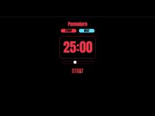
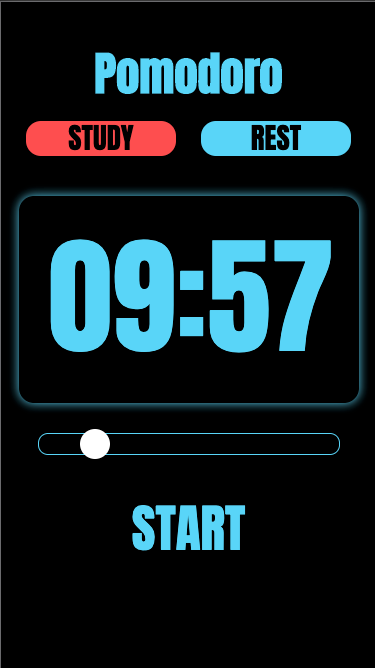

# Pomodoro App Created With React
A simple productivity tool which was created with React by using Context API and styled-components.

----
## Live Version
Website is hosted on [gh-pages](https://ozansozuozgit.github.io/pomodoro-react/)

  

## Purpose of This Project
To use the following concepts:
* React Core
* Context API
* styled-components
* useState,useEffect,useReducer,useContext

